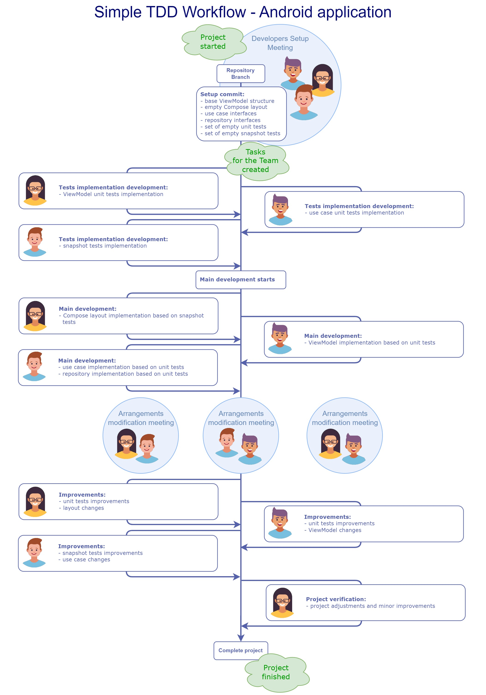

# Simple Clean Architecture - Android Compose Example

## About

This is just an example of the Android Clean Architecture implementation. The main assumption of the
project is to be as simple as possible,
but also provide layers possible to be tested by unit tests.

The Clean Architecture approach was described by Robert C. Martin here: https://blog.cleancoder.com/uncle-bob/2012/08/13/the-clean-architecture.html.

## Main advantages of this architecture:

- viewModel and use case layers testable by unit test
- clear separation of data logic from the layout
- the whole logic is represented by simple data, making it easier to track it
- functional approach in order to simplify the code
- minimal view layer logic, reduced to Compose layout without data processing logic
- clear separation of concerns
- minimal and unified set of architecture components

## Components and layers:
In order to provide best performance, simplicity and scalability of this architecture, the layers should meet several requirements described below. 

### Repositories
Repositories are responsible for providing data for the application logic (use cases and interactors). Repository is an interface with dedicated implementation, where only the interface is visible for the application logic layer and the implementation is provided using dependency injection. Repository methods can be single or multithreaded, however the multithreaded methods should autonomously manage the threads they use and cannot rely on the threads defined by the method caller. The caller should only care about its own thread.  
Repository interface methods should use only basic data types that can be handled by the unit test environment, otherwise tests maintenance will be much more complex. Data classes with basic data types would work best.  
On the other hand, repository implementation is free to use any required types, libraries, services, SDKs and APIs in order to get the data, as long as it's possible to map the result to the repository interface requirements. Using Android SDK classes (like application Context) in the implementation is also fine as long as it doesn't cause any issues such as memory leaks or performance issues.

### Use cases and interactors
This layer is considered as a set of application functions processing the data. Its responsibility is only to process the data from parameters and repositories into another data as a result. All these functions form the rules of application logic.  
Use case is the part of application logic that fulfill single, specific function. It consists of an interface and its implementation. Use case interface is required to be a functional interface (SAM Kotlin interface). Use case implementation should be stateless single or multithreaded function where multithreaded code should maintain its threads autonomously without the need for external management.  
Interactor is a set of use cases or other stateless functions processing data.  
In order to handle some specific requirements, use cases and interactors can be reused and combined into more general use cases.  
In general, this layer can be compared to a composite mathematical function - all the data collected from user input and repositories is processed by a set of functions and use cases that produce the output result, so functional programming approach can be very handy. This means that in order to simplify the code, some common application components could be migrated into simple functions. For example we could implement validators as interactors.  
All components of this layer should be testable using unit tests, therefore they should only use data classes and basic data types that can be easily processed in unit test environment. Otherwise tests maintenance will be much more difficult and complex.

### ViewModel with state object
ViewModel layer contains the logic for the view presentation. It is responsible for the logic of the screen presented to the user. It should get the data from use cases and user input, process it and present the result for the View layer using UI state object and set of UI effects. User input is handled by a set of user actions defined as methods.  
The UI state object is a data class containing the state of View elements and is emitted on every change to the View layer. Every emission of the UI state causes View recomposition. The UI state should contain only the values with some logic behind which can't be simply put in the View, like data from use cases, ViewModel specific logic or input controls values.   
The UI effect is defined as an enum or sealed class and contains definitions of UI one-time events that should be emitted to the View and rendered. For example, it can be a snackbar event.  
The user actions are methods in ViewModel, that can be called by the View to handle some user action e.g. user login or refresh screen. Usualy such actions cause a new UI state or effect emission.  
All components of this layer should be testable using unit tests, therefore they should only use data classes and basic data types that can be easily processed in unit test environment. Otherwise unit tests maintenance will be much more difficult and complex.

### View
View layer is responsible for visual representation of the ViewModel data on screen displayed to the user. It should react for the UI state and effects emissions and refresh corresponding parts of the layout. It should also pass the user actions to the ViewModel using defined ViewModel methods. It should contain as less logic as possible and rely on the ViewModel logic. In this project it's represented by the Jetpack Compose layouts.

## Practical/pragmatic remarks:

- it's hard to completely avoid references to Android classes in any part of code as sometimes there
  is just no effective way to reconcile
  the functional requirements (e.g. Parcelable data classes, libraries dependencies). As the main
  purpose is to write testable code,
  I'd consider it acceptable, as long as unit tests work and we don't need to call Android SDK
  methods during tests - please refer to:
  https://developer.android.com/training/testing/unit-testing/local-unit-tests#mocking-dependencies
  In other words: the purest structure we maintain, the less problems and bugs we have, but if we
  need to write own version of huge external library to achieve
  the Android SDK separation, maybe making exception would be a better choice.
- TODO: other remarks

## Simple TDD Workflow

When using the project structure described above, it's also possible to easily implement the Test Driven Development approach and distribute tasks among team members more swiftly. Let's consider single screen workflow.

1. Developers start work on the project with a meeting where they discuss the new screen functionality and collaboratively establish main elements based on the acceptance criteria outlined in the task:
   - view model with empty methods and base ui state object
   - empty layout
   - use case interfaces
   - repository interfaces
   - set of empty unit and snapshot tests which after implementation will verify the previously mentioned elements
  
   If necessary, the components above can be determined by one person. However, collaborative agreements allow for a broader perspective on the project and capture a greater number of edge cases and possible issues. This results in more precise preliminary agreements and the better project awareness among the team members.
   
   Next, all those empty components are committed and pushed to the repository. We can use separate feature branch for this particular screen.

2. In the next step we should prepare single task for each component. We shouldn't split the single component implementation into several tasks. For instance, we should not split the implementation of a view model among multiple tasks, but we should rather separate the entire implementation of specific element.

3. The development starts - all unit and snapshot tests should be prepared first, before the main application components.

4. We proceed with main development and we create all the application components using the tests prepared in the previous step for verification. During the process, we refine details that may not have been uncovered during the preparation of basic elements and tests.

5. The final step is to assemble all the elements together. After that, most functions should work correctly, however some integration improvements may also be necessary. The tasks of refining elements are assigned according to the earlier assignment of work as much as possible.

### Workflow example:
Bob, Alice and John are developers working in a three-person team together. The team has been tasked with adding a new user authorization screen to the application. Alice will lead the project. Example workflow could look like this:
1. The team gathers to plan the work. During the meeting led by Alice, she creates the required base classes and adjusts the code as discussed with the team. These classes include:
   - simple view model with empty methods for login and password fields update and submit the form
   - data class for the ui state including properties for the layout
   - empty screen layout
   - user login use case interface for submit action
   
   Next, in the second stage of the meeting, the whole team examine together all the possible test cases for the view model, use case and layout. Alice creates test classes for the components (unit test classes for the view model and the use case and snapshot test class for the layout) and writes down all the agreed test cases aiming to describe each one in the function name in the clearest way possible.
   
   At the end of the meeting, Alice verifies the correctness of the agreed code and commits the changes to the common branch which will be the base for single component branches.

2. The work should start with writing automated tests. The most desirable solution is, when every team memeber creates the tests for the part of the code, he needs to make use of in his own task. Alice manages the task assingment in the following way:
   - John will create view model and Alice will write unit tests for it
   - Bob will create the use case and required repository implementations and John will write the unit tests for this use case
   - Alice will implement the compose layout and Bob will create the snapshot tests for this layout
   - unit tests will be created on the very beginning of the project and committed to the common repository branch to be available for all the team memebers before the main development
   - when all the components are ready, Alice will assemble it together and assign the tasks for bugfixes if needed

3. Alice creates unit tests for the view model. John creates unit tests for the use case. Bob creates the snapshot tests for the layout. Everyone commits their changes to the repository.

4. The work on actual code looks as follows:
   - Alice starts working on the layout and checks the results using snapshot tests
   - Bob starts working on the use case and the repository referring to the server service logging in users
   - John starts working on view model
   - meanwhile, some new business requirements appeared: in case of errors server service will respond with some user login validation messages which should be presented on the screen while submitting
   - Bob agrees with Alice the new feature and changes the snapshot tests
   - Bob agrees with John improvements on use case interface and data model
   - John changes unit tests for the use case and updates his code
   - John agrees with Alice the changes in the view model to present the validation
   - Alice changes unit tests for the view model and updates her code
   - after the components are finished, everyone commits their code to the common branch

5. Alice checks the new screen functionality:
   - during the checks it turned out, the user login validation messages are not displayed, so the team investigates the issue
   - it turned out, that one of the unit tests has a bug and is not checking the view model correctly, so Alice fixes the bug in unit test and then John fixes the view model
   - other minor issues are also found and fixed
   - the working project can be finished

